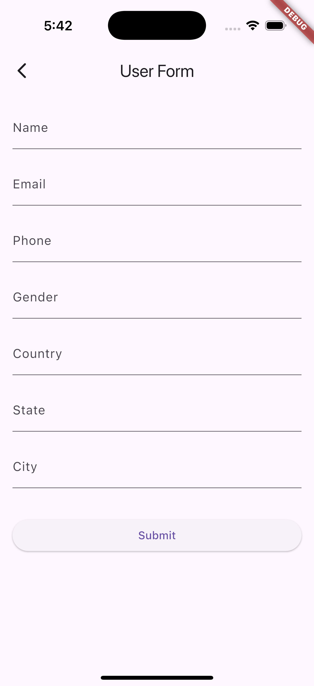
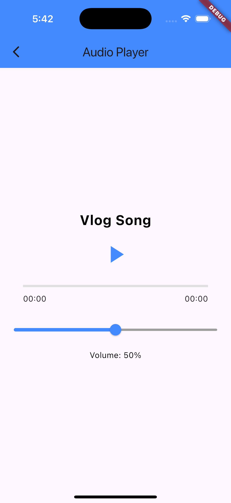

# News App Pro 📰

A modern news aggregation app built with Flutter. The app fetches real-time news articles and displays them in a user-friendly interface. It includes a splash screen, a list of news articles, article details, and additional features like an audio player and user form. The app uses the [News API](https://newsapi.org/) for fetching news data.

---

## 📱 Features
- **Home Screen**: Displays a list of news articles fetched from the API.
- **News Detail Screen**: Provides detailed information about a selected news article.
- **User Form Screen**: Allows users to fill in their personal details.
- **Audio Player**: Plays audio files directly within the app.

---

## 🛠️ Technologies Used
- **Flutter**
- **Dart**
- **News API**
- **Flutter BLoC**
- **Share Plus Plugin**
- **Hero Animations**

---

## 🖼️ Screenshots

### Home Screen

### News Detail Screen

### User Form Screen

### Audio Player Screen
